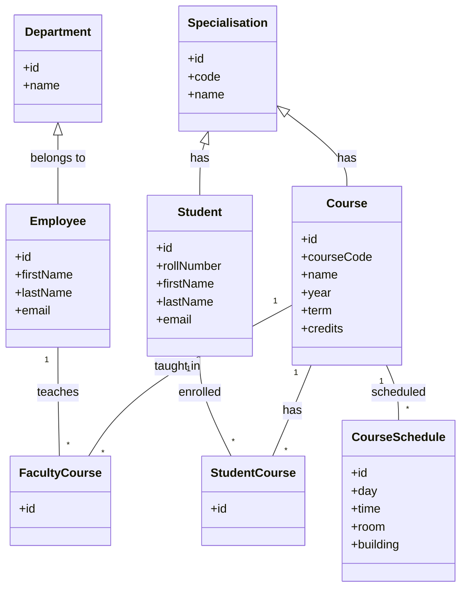

# Deliverable #2: Database Design

## a) Conceptual Design (Class Diagram)



Notes:
- Only classes relevant to Faculty Timetable feature are included.
- Associations capture teaching assignment, enrollment, and scheduling.

---

## b) Logical Design (ORM Mapping Overview)

- Department → table `departments(id PK, name)`
- Employee → table `employees(employee_id PK, first_name, last_name, email UNIQUE, department_id FK→departments.id)`
- Specialisation → table `specialisations(specialisation_id PK, code UNIQUE, name)`
- Course → table `courses(course_id PK, course_code UNIQUE, name, year, term, credits, specialisation_id FK→specialisations.id)`
- Student → table `students(student_id PK, roll_number UNIQUE, first_name, last_name, email, specialisation_id FK→specialisations.id)`
- FacultyCourse → table `faculty_courses(id PK, faculty_id FK→employees.id, course_id FK→courses.id, UNIQUE(faculty_id, course_id))`
- StudentCourse → table `student_courses(id PK, student_id FK→students.id, course_id FK→courses.id, UNIQUE(student_id, course_id))`
- CourseSchedule → table `course_schedule(id PK, course_id FK→courses.id, day, time, room, building)`

Indexes:
- employees(email), students(roll_number), courses(course_code) unique indexes.
- Foreign key indexes on all FK columns for join performance.

---

## c) Implementation Design (SQL Scripts)

This deliverable contains 3 SQL files placed under `backend/db/`:
- create_schema.sql
- alter_constraints.sql
- insert_seed.sql

Run order:
1) create_schema.sql
2) alter_constraints.sql
3) insert_seed.sql

Example execution (MySQL):
```
mysql -u root -p academic_erp < backend/db/create_schema.sql
mysql -u root -p academic_erp < backend/db/alter_constraints.sql
mysql -u root -p academic_erp < backend/db/insert_seed.sql
```

Best practices applied:
- InnoDB engine, utf8mb4 charset/collation.
- Narrow VARCHARs on codes and emails.
- Surrogate integer PKs, natural keys constrained as UNIQUE.
- All FKs added after base tables (in alter script) with ON DELETE rules where appropriate.
